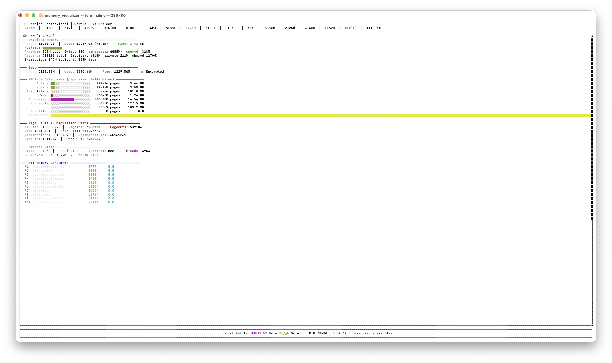

# ⚡ Terminaline

A comprehensive, real-time macOS system inspector built with [Ratatui](https://ratatui.rs). Navigate 18 interactive tabs covering every corner of your hardware — from RAM pressure and CPU topology to live network connections, Bluetooth devices, security settings, and disk file browsing.

  



---

## Features

| Tab | Key | What It Shows |
|-----|-----|---------------|
| **Activity** | `0` | **Live** per-process network connections — PID, protocol, local/remote addresses, state, with connection detail panel |
| **RAM** | `1` | Physical/virtual memory, VM page stats, swap, compression, memory pressure gauge, sparkline history |
| **Map** | `2` | Process memory regions with cursor selection — address range, size, permissions (R/W/X), region type, full path |
| **Visual** | `3` | Address-space block map with color-coded region types, memory breakdown bars, selected-region highlight |
| **CPU** | `4` | Brand, architecture, P/E core topology, cache hierarchy, ARM64 flags, register architecture, per-core usage sparklines |
| **Disk** | `5` | Hardware info, SMART status, I/O rates, partition list with usage gauges — **Enter** to browse files with sort & system-file filter |
| **Network** | `6` | Lifetime packet/byte totals, per-interface details (IP, MTU, status, errors), traffic sparklines |
| **GPU** | `7` | Chipset, Metal version, cores, vendor, display info, Unified Memory Architecture |
| **Battery** | `8` | Charge gauge, state, cycle count, health %, voltage, current, temperature |
| **Camera** | `9` | Connected cameras with model ID and unique ID |
| **Processes** | `S-P` | Full process list with PID, User, CPU%, Mem%, Threads, State, and Command |
| **Bluetooth** | `S-B` | Controller state, chipset, firmware, discoverable status, paired devices, and services |
| **USB** | `S-U` | USB buses & connected devices (Vendor, Product ID, Speed, Power) and Thunderbolt link status |
| **Audio** | `S-A` | Input/Output devices, default selection, transport type, sample rate, and channel count |
| **Security** | `S-S` | Status for SIP, Gatekeeper, FileVault, and Application Firewall |
| **Services** | `S-L` | Active system services (LaunchDaemons & Agents) with PID and Last Exit code |
| **Wi-Fi** | `S-W` | Current SSID, BSSID, Channel, Signal (RSSI), Noise, Tx Rate, Security, and PHY Mode |
| **Thermal** | `S-T` | Thermal pressure state, CPU/GPU thermal levels, and battery temperature |

*(Note: `S-` prefix means Shift + Key, e.g., `S-P` is Shift+P / capital 'P')*

## Keyboard Controls

| Key | Action |
|-----|--------|
| `1`–`9`, `0` | Jump to primary tabs |
| `P`, `B`, `U`, `A`, `S`, `L`, `W`, `T` | Jump to secondary extended tabs (Processes, Bluetooth, USB, etc.) |
| `Tab` / `Shift+Tab` | Next / Previous tab sequentially |
| `←` / `→` | Previous / Next tab (context-aware in Disk file browser) |
| `↑` / `↓` / `j` / `k` | Scroll or move cursor vertically |
| `PgUp` / `PgDn` | Jump 10–20 items |
| `Enter` | Open partition (Disk) / Navigate into folder |
| `Esc` | Go back (Disk file browser) / Quit |
| `s` | Cycle sort mode (Disk files: size↓, size↑, name A→Z, name Z→A) |
| `f` | Toggle system-file filter (Disk files) |
| `q` | Quit |

## Data Sources

All data is collected from native macOS APIs and CLI tools — no third-party daemons required:

- **`sysctl`** — CPU topology, cache sizes, ARM64 features, physical memory, thermal levels
- **`vm_stat`** — VM page statistics, compressions, faults
- **`top -l1`** — Process stats, CPU usage, disk I/O, network totals
- **`iostat`** — Disk transfer rates
- **`diskutil`** — Disk hardware, SMART status
- **`netstat`** — Per-interface network stats
- **`ifconfig`** — Interface IP and status
- **`lsof`** — Live per-process network connections
- **`pmset -g batt`** / **`ioreg`** — Battery details, thermal sensors
- **`system_profiler`** — GPU, camera hardware, bluetooth, USB, audio, wifi
- **`ps aux`** — Detailed process list
- **`csrutil`, `spctl`, `fdesetup`** — Security settings (SIP, Gatekeeper, FileVault)
- **`defaults read`** — Firewall settings
- **`launchctl list`** — System services
- **`networksetup`** — Wi-Fi hardware and network state
- **`proc-maps`** crate — Process memory region mapping

## Requirements

- **macOS** (ARM64 / Apple Silicon highly recommended)
- **Rust** 1.70+ with Cargo

## Build & Run

```bash
# Clone
git clone https://github.com/thatgroot/Terminaline.git
cd Terminaline

# Run (debug)
cargo run

# Build optimized release binary
cargo build --release --target aarch64-apple-darwin

# Run the release binary
./target/aarch64-apple-darwin/release/terminaline
```

## Dependencies

| Crate | Purpose |
|-------|---------|
| [`ratatui`](https://ratatui.rs) | Terminal UI framework |
| [`crossterm`](https://docs.rs/crossterm) | Terminal raw mode, keyboard events |
| [`sysinfo`](https://docs.rs/sysinfo) | Cross-platform system info (disk, CPU) |
| [`proc-maps`](https://docs.rs/proc-maps) | Process memory region mapping |

## Architecture

Terminaline employs a modular architecture designed for maintainability and clear separation of concerns:

```
src/
├── main.rs          → Entry point, terminal setup, main loop, layout routing
├── app.rs           → Centralized App state holding all collected data
├── types.rs         → Shared data structures across modules
├── utils.rs         → Helper functions for executing CLI tools safely
├── input.rs         → Global and tab-specific keyboard event handling
├── collectors/      → Modules responsible for gathering data (`cpu.rs`, `ram.rs`, etc.)
└── ui/              → Modular UI rendering functions (`cpu.rs`, `ram.rs`, etc.)
```

Refresh strategy:
- **Every tick** (~1s): RAM, CPU, Process maps, I/O, network, thermal sensors, top processes
- **Every 3 ticks**: Activity connections (`lsof`)
- **Every 5 ticks**: Disk list, battery, wifi, bluetooth, processes
- **Every 30+ ticks**: GPU, cameras, hardware, security, services, USB, audio

## License

MIT
